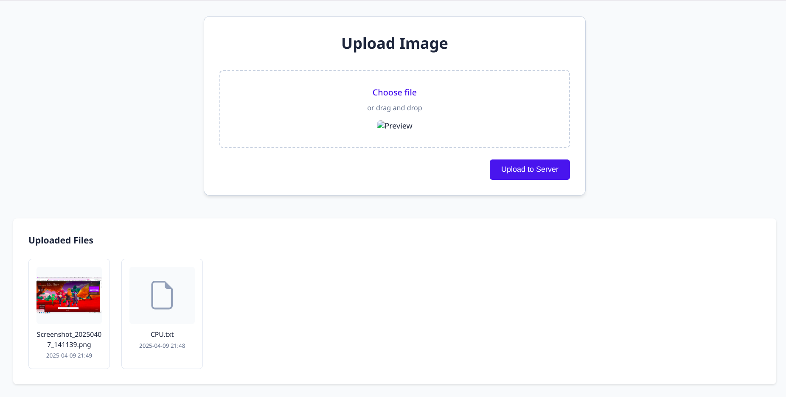

# SFTP FileStream 🔄🔒


A secure enterprise-grade file management system with SFTP integration and audit capabilities.



## 📖 Table of Contents
- [Features](#-features)
- [Usage](#-usage)
- [Tech Stack](#-tech-stack)
- [License](#-license)
- [Acknowledgments](#-acknowledgments)

## 🌟 Features
- **Secure SFTP Transfers**  
- **File Metadata Tracking** (Name, Size, Type, Path)
- **Dockerized Environment** (Flask + MariaDB + SFTP)
- **Responsive Web Interface**
- **File History with Pagination**
- **Download Management System**
- **Environment-Based Configuration**

## 🚀 Installation

### Prerequisites
- Docker 20.10+
- STFP
- Mysql/MariaDB

### Usage
```bash
# Clone repository
git clone https://github.com/Malek-trez/FileStream
cd FileStream

# Copy environment template
touch .env
```
Copy the following into `.env` and fill in your values:
```env
# Database
DB_HOST=db
DB_PORT=3306
DB_NAME=pfa
DB_USER=pfa_user
DB_PASS=test
DB_ROOT_PASSWORD=rootpassword

# SFTP
SFTP_HOST=sftp
SFTP_PORT=22
SFTP_USER=user
SFTP_PASS=pass
SFTP_UPLOAD_DIR=/home/user/uploads
```

Build and start containers
```bash
docker build -t flaskapp .
docker run -d -p 5000:5000 --name flask-container flaskapp
```
### Access the Application

Open your browser and navigate to:  
[http://localhost:5000](http://localhost:5000)

## 📄 License

This project is licensed under the MIT License.  
See the [LICENSE](LICENSE) file for details.

## 🙏 Acknowledgments

Developed as part of my end-of-year academic project.  
Special thanks to DeepSeek AI for development assistance.


